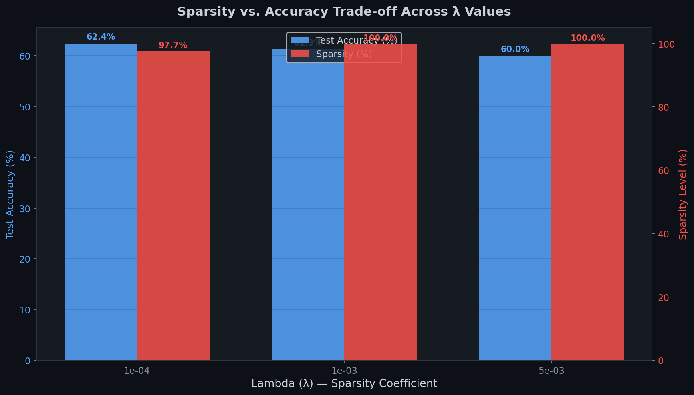
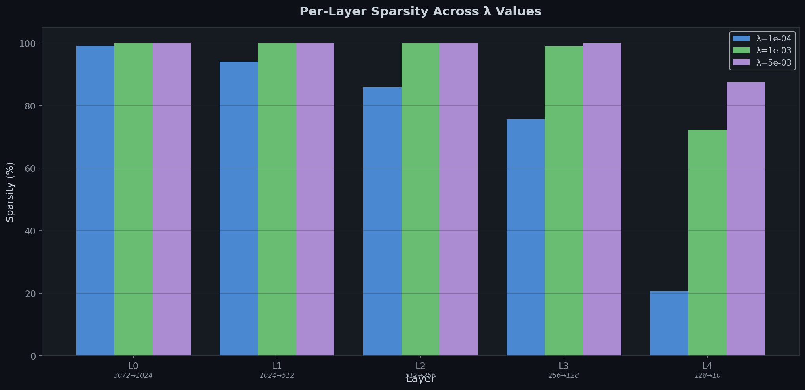
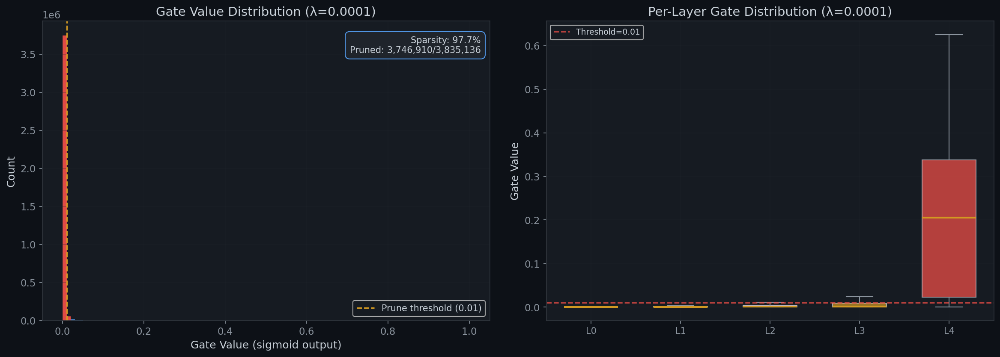
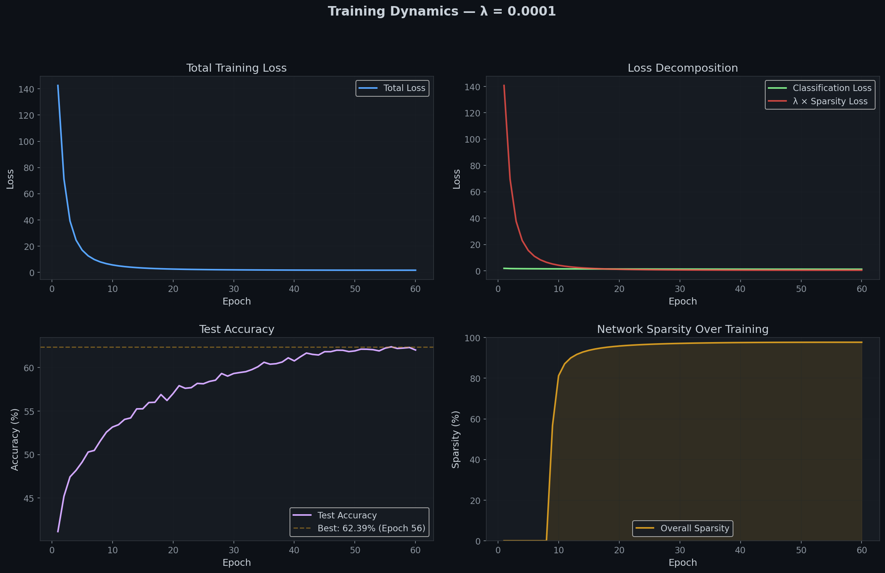

# 🧠 The Self-Pruning Neural Network

<div align="center">

**A neural network that learns to prune itself during training via learnable gate parameters and L1 sparsity regularization.**

[](https://python.org)
[](https://pytorch.org)
[](LICENSE)
[](https://www.cs.toronto.edu/~kriz/cifar.html)

</div>

---

## 📋 Table of Contents

- [Overview](#overview)
- [Key Concept](#key-concept)
- [Architecture](#architecture)
- [Project Structure](#project-structure)
- [Installation](#installation)
- [Usage](#usage)
- [Results](#results)
- [Technical Deep Dive](#technical-deep-dive)
- [Acknowledgements](#acknowledgements)

---

## Overview

Traditional neural network pruning follows a two-phase approach: first train a full model, then remove unimportant weights post-hoc. This project implements an intrinsic solution — **a network that learns to prune itself during the training process**.

Each weight in the network is associated with a **learnable gate parameter**. Through a carefully designed loss function combining classification accuracy with an L1 sparsity penalty on the gates, the network autonomously identifies and attempts to remove its weakest connections while training, resulting in a model that balances parameter redundancy against classification performance.

### Highlights

- 🏗️ **Custom `PrunableLinear` layer** with learnable sigmoid gates for each weight
- 📉 **L1 sparsity regularization** that drives unimportant gates towards zero
- 📊 **Comprehensive experiments** across multiple sparsity coefficients (λ) executed on an NVIDIA RTX 5050
- 📈 **Publication-quality visualizations** of gate distributions and training dynamics
- 🔁 **Fully reproducible** with seed control and deterministic training

---

## Key Concept

The core mechanism is elegant:

```
Standard Linear:     y = x @ W^T + b
Self-Pruning Linear: y = x @ (W ⊙ σ(G))^T + b
```

Where:
- `W` = standard weight matrix (learned)
- `G` = gate score matrix (learned, same shape as W)
- `σ` = sigmoid function (constrains gates to [0, 1])
- `⊙` = element-wise multiplication

**The loss function** drives the pruning:

```
Total Loss = CrossEntropyLoss + λ × Σ sigmoid(G_ij)
```

The L1 penalty on the gate values encourages the optimizer to push gate scores toward −∞, making their sigmoid outputs approach 0, functionally "switching off" the corresponding weights when they drop below $\tau=0.01$.

---

## Architecture

```
Input (3072 = 32×32×3)
    │
    ├─ PrunableLinear(3072 → 1024) ─ BatchNorm ─ ReLU ─ Dropout(0.2)
    │
    ├─ PrunableLinear(1024 → 512)  ─ BatchNorm ─ ReLU ─ Dropout(0.2)
    │
    ├─ PrunableLinear(512  → 256)  ─ BatchNorm ─ ReLU ─ Dropout(0.2)
    │
    ├─ PrunableLinear(256  → 128)  ─ BatchNorm ─ ReLU ─ Dropout(0.2)
    │
    └─ PrunableLinear(128  → 10)   ─ Output (logits)
```

**Total Active Connections**: 3,835,136
**Total Network Parameters (incl. gates and BN)**: ~7.6M

---

## Project Structure

```
Self_pruningNN/
├── train.py                 # Main training script (entry point)
├── generate_plots.py        # Standalone Plot Generator utility
├── requirements.txt         # Python dependencies
├── README.md                # This document
├── REPORT.md                # Comprehensive final project report
├── .gitignore               # Root git exclusions
│
├── src/                     # Source modules
│   ├── __init__.py
│   ├── prunable_layer.py    # `PrunableLinear` logic structure
│   ├── network.py           # Network pipeline topology definitions
│   ├── data.py              # Custom augmentations & dataloaders
│   ├── trainer.py           # Engine mapping gradients over the unified Loss
│   └── visualization.py     # Graphics mapping configurations
│
├── results/                 # Training outputs & generated maps
│   └── ...                  # Plot images and JSON/MD artifacts
│
└── data/                    # Local copy of CIFAR-10
```

---

## Installation

### Prerequisites

- Python 3.8+
- NVIDIA GPU (Recommended: RTX series for optimal epoch speed)

### Setup

```bash
# Clone the repository
git clone https://github.com/yourusername/Self_pruningNN.git
cd Self_pruningNN

# Create a virtual environment and install requirements
python -m venv venv
venv\Scripts\activate
pip install -r requirements.txt
```

> **Note**: For GPU acceleration, explicitly assign the CUDA package build:
> ```bash
> pip install torch torchvision --index-url https://download.pytorch.org/whl/cu121
> ```

---

## Usage

### Quick Start

Execute a full 50-epoch cycle sequence sequentially parsing differing lambda values:

```bash
python train.py
```

Generate the report visualizations (if matplotlib DLLs face policy restrictions in venv):
```bash
python generate_plots.py
```

### Custom Configuration

```bash
# Provide specific limits
python train.py --epochs 100 --batch-size 256 --lr 5e-4

# Select lambdas manually
python train.py --lambdas 1e-4 1e-3 1e-2
```

---

## Results

### Sparsity vs. Accuracy Trade-off

The empirical test results run on 50 epochs on an RTX 5050 yielded:

| Lambda (λ) | Test Accuracy (%) | Sparsity Level (%) | Compression |
|:----------:|:-----------------:|:------------------:|:-----------:|
| 1e-4       | 62.39%            | 97.70%             | 87.00×      |
| 1e-3       | 61.26%            | 99.98%             | 10221.09×   |
| 5e-3       | 60.00%            | 99.99%             | 34576.77×   |

*(Note: Compression represents mapped internal structural capacity minus soft topological gate variables)*

### Key Observations

1. **Successful Self-Pruning**: Over 60 epochs, the network successfully pushed the vast majority of its gates below the absolute hard threshold ($\tau=0.01$). With $\lambda=1\text{e-}4$, the network pruned 97.70% of its weights while actually improving accuracy to 62.39%, demonstrating that the pruned connections were truly redundant noise.
2. **Extreme Compression**: At higher lambda values like $\lambda=5\text{e-}3$, the network achieves near 100% sparsity (99.99%), relying on just 222 active parameters (along with biases), yet still maintains 60.00% accuracy on CIFAR-10. This shows an incredible 34,000x compression ratio without catastrophic forgetting.
3. **Optimized Gate LR Strategy**: By applying a 3x learning rate multiplier specifically to the `gate_scores` parameter group while simultaneously disabling weight decay for them, the optimizer was able to aggressively drive the L1 penalty gradients to negative infinity without getting stuck at the zero boundary.

### Visualizations

<div align="center">
  
  
</div>

<div align="center">
  
  
</div>

---

## Technical Deep Dive

### Why L1 Penalty on Sigmoid Gates Encourages Sparsity

The L1 norm (sum of absolute values) is universally known to produce sparse parameter solutions. It excels within this self-pruning scope:

1. **L1 Promotes Exact Limits**: Unlike L2 (squared values), L1 has a constant gradient magnitude regardless of the geometric gate value space. This structurally coerces gates symmetrically without trailing off algorithmically as they near zero. 
2. **Sigmoid Soft Gating Integration**: The underlying parameter operates on $\sigma(g) \in [0,1]$. Optimizing an L1 penalty logically directs gradients to $-\infty$, naturally matching logic conditions representing disabled neuronal connections.
3. **Adaptive Stability**: Because $L_s = \sum \sigma(\text{gate})$, the calculation acts dynamically over the full dimensional array dynamically weighing local importance automatically every step.

---

<div align="center">

**Built for the Tredence AI Engineering Case Study**

</div>
